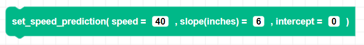

##### Block



##### Description

Manually sets the line of best fit parameters that are used with ```move_to_coordinate()```. This block overrides any speed prediction values that were automatically set with the ```speed_calibration()``` block.

##### Parameters

**speed**: Integer speed from 0 to 100 used for calibrating distance traveled

##### Returns

None

##### Example

<!-- image -->
