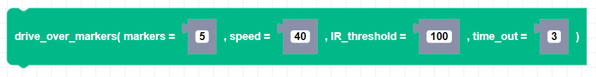

##### Block

##### Description

Zumi will drive over the specified number of alternating black and white horizontal lines at least 2 centimeters wide. Zumi will stop when the number of markers have been crossed or if the timeout ends, whichever is first. (Avoid making the speed very high, zumi will most likely overshoot since it has a lot of speed)

##### Parameters

**markers**: The number of road markers to drive over 
**speed**: Positive integer value for speed between 0 and 80 
**IR_threshold**: The IR threshold value for the bottom left IR sensors to detect black or white. 
**time_out**: Number of seconds before the timeout ends and Zumi stops driving. 

##### Returns

None

##### Example

Drive over 5 markers with a timeout of 3 seconds.

